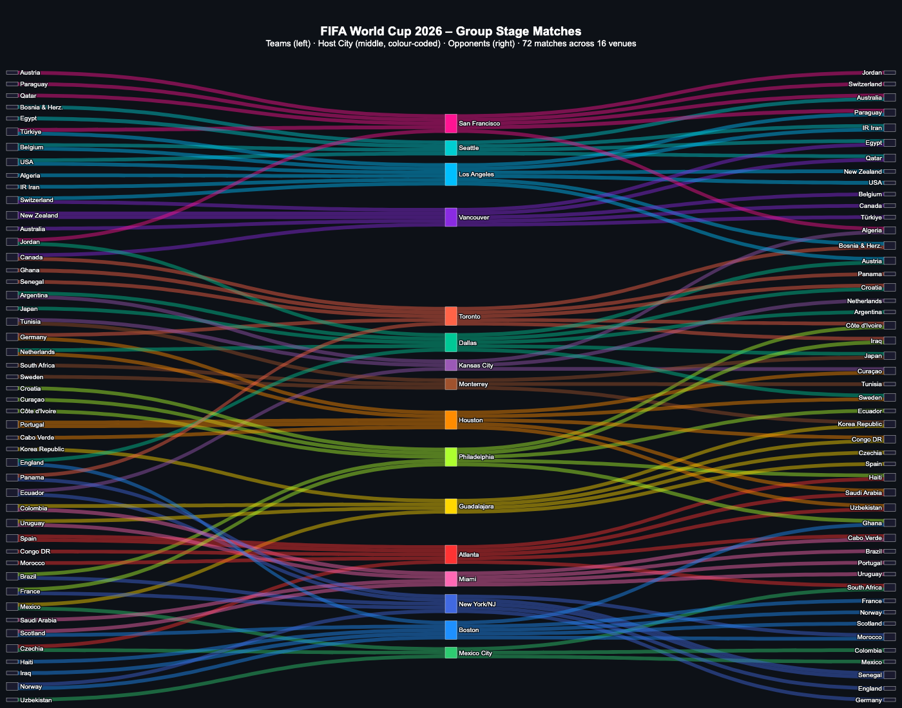
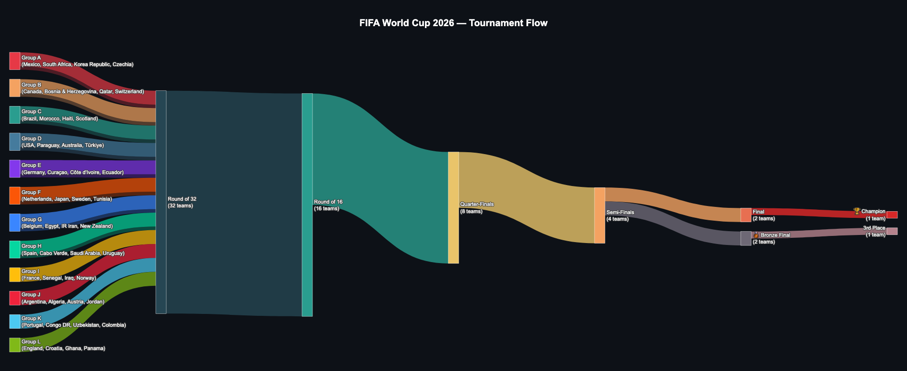

# ⚽ FIFA World Cup 2026 - Tournament Flow Visualization

This repository contains Python scripts and interactive HTML visualizations mapping out the match schedule for the 2026 FIFA World Cup using Sankey diagrams. 

## Project Overview
The visualizations help map the complex 72-match group stage across 16 venues, connecting teams to their host cities and opponents. 

## 🛠️ Technical Stack
* **Python** * **Plotly** (Graph Objects)
* **HTML/CSS** (for output rendering)

## 🚀 How to Run the Code
1. Clone this repository to your local machine.
2. Install the required dependencies:
   ```bash
   pip install -r requirements.txt

### Files Included:
* **`FWC26 Match Schedule_v17_10042026_EN.pdf`**: The original FIFA World Cup 2026™ match schedule.
* **`fwc2026_group_stage_sankey.html`**: An interactive diagram focusing specifically on the Group Stage match-ups and host cities.
* **`fwc2026_sankey_overall.html`**: An interactive diagram displaying the overall flow of the tournament.

## 📈 Visualizations


*Figure 1: An interactive diagram focusing specifically on the Group Stage match-ups and host cities.*


*Figure 2: An interactive diagram displaying the overall flow of the tournament.*


*The original FIFA World Cup 2026™ match schedule.*
FWC26 Match Schedule_v17_10042026_EN.png
